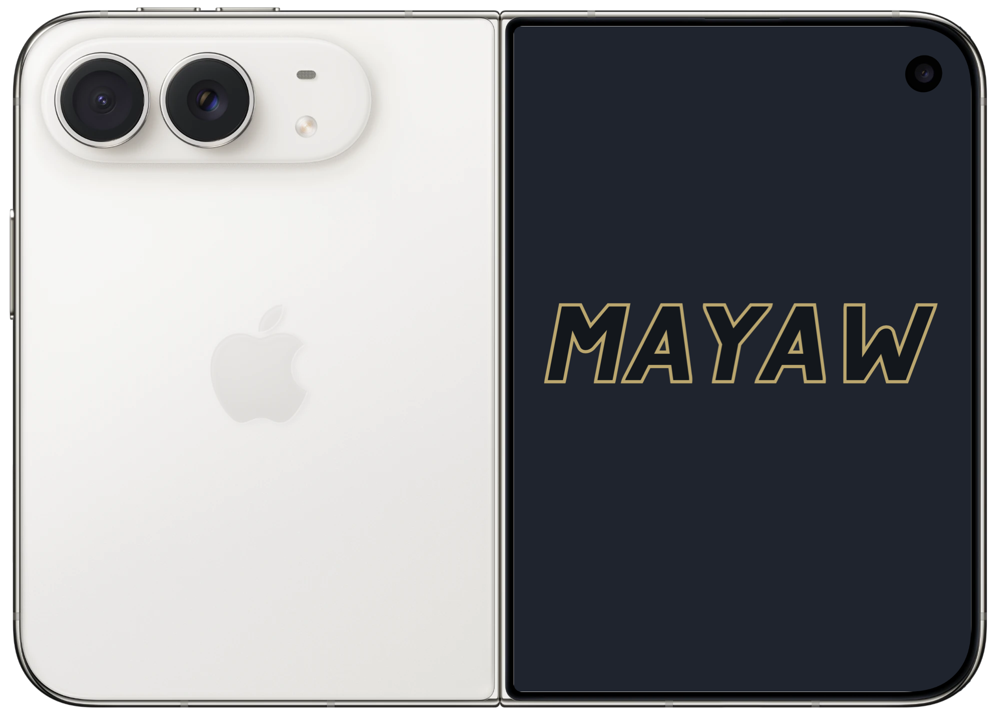

# MAYAW

> A custom wordmark drawn entirely with SwiftUI's built-in shapes.

[English](#english) · [繁體中文](#繁體中文)

[](https://www.swift.org/)
[](https://developer.apple.com/xcode/swiftui/)
[](https://github.com/PeterPanSwift/MAYAW)



<a id="english"></a>

## English

[繁體中文](#繁體中文)

### ✨ Overview

MAYAW is a compact SwiftUI demonstration that recreates a custom outlined wordmark from geometry. Every letter is assembled from native `Capsule` and `Rectangle` shapes, then combined, clipped, transformed, filled, and stroked directly in SwiftUI.

The rendered logo uses no custom font, source image, `Canvas`, or hand-written `Path`.

### Features

- Builds all five letters from reusable SwiftUI shape primitives.
- Uses shape unions to create clean, continuous outlines at stroke intersections.
- Applies a single affine transform for the wordmark's forward slant.
- Scales proportionally to the available space with `GeometryReader`.
- Exposes the complete wordmark as one accessible element.
- Runs from one small, dependency-free Xcode project.

### Requirements

| Component | Requirement |
| --- | --- |
| Xcode | A version that includes the Apple 27 SDKs |
| Swift | 5.0 or later |
| Platforms | iOS 27+, macOS 27+, visionOS 27+ |

### 🚀 Quick Start

```bash
git clone https://github.com/PeterPanSwift/MAYAW.git
cd MAYAW
open MAYAW.xcodeproj
```

Select the `MAYAW` scheme and run it on a supported destination.

### How It Works

Each letter is made from rotated and positioned capsules. SwiftUI's `union` operation joins those strokes before the fill and outline are applied, which prevents internal seams where strokes overlap. A rectangular intersection keeps the top and bottom edges aligned, and an affine transform gives the complete wordmark its italic angle.

### Project Structure

```text
MAYAW/
├── Documentation/
│   └── mayaw-device-preview.png
├── MAYAW/
│   ├── ContentView.swift      # Shape-based logo and presentation
│   └── MyApp.swift            # App entry point
└── MAYAW.xcodeproj/
```

---

<a id="繁體中文"></a>

## 繁體中文

[English](#english)

### ✨ 專案介紹

MAYAW 是一個精簡的 SwiftUI 示範專案，以幾何圖形重現自訂外框字樣。每個字母都由原生 `Capsule` 與 `Rectangle` 組成，接著直接透過 SwiftUI 完成合併、裁切、變形、填色與描邊。

畫面中的標誌不使用自訂字型、來源圖片、`Canvas` 或手寫 `Path`。

### 特色

- 使用可重複利用的 SwiftUI 內建形狀組成五個字母。
- 透過形狀聯集消除筆畫交會處的內部接縫，形成連續外框。
- 對完整字樣套用單一仿射變形，呈現向前傾斜的視覺效果。
- 使用 `GeometryReader` 依可用空間等比例縮放。
- 將完整字樣提供為單一無障礙元素。
- 專案精簡且不依賴第三方套件。

### 系統需求

| 項目 | 需求 |
| --- | --- |
| Xcode | 包含 Apple 27 SDK 的版本 |
| Swift | 5.0 或更新版本 |
| 平台 | iOS 27+、macOS 27+、visionOS 27+ |

### 🚀 快速開始

```bash
git clone https://github.com/PeterPanSwift/MAYAW.git
cd MAYAW
open MAYAW.xcodeproj
```

選擇 `MAYAW` scheme，並在支援的執行環境中啟動專案。

### 實作原理

每個字母由旋轉及定位後的膠囊形筆畫組成。SwiftUI 的 `union` 會先將筆畫合併，再套用填色與外框，因此重疊處不會留下內部接縫。接著使用矩形交集對齊上下邊緣，最後透過仿射變形讓完整字樣呈現斜體角度。

### 專案結構

```text
MAYAW/
├── Documentation/
│   └── mayaw-device-preview.png
├── MAYAW/
│   ├── ContentView.swift      # Shape 字樣與畫面呈現
│   └── MyApp.swift            # App 進入點
└── MAYAW.xcodeproj/
```

---

[Back to English](#english)
